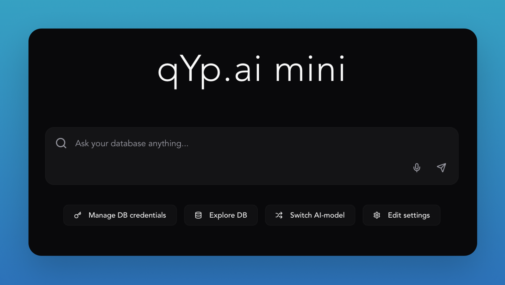

# qYp mini app

   

🤖 AI-agent for SQL databases with generative UI. A little open source brother for [qyp.ai](https://qyp.ai).

# Tech stack:

- [Tauri](https://tauri.app/) + [Vite](https://vitejs.dev/) + [React](https://react.dev/) + [Typescript](https://www.typescriptlang.org/)
- [Tailwind](https://tailwindcss.com/) + [shadcn/ui](https://ui.shadcn.com/)
- [Cursor](https://www.cursor.com/) + [Supercode.sh](https://supercode.sh/)
